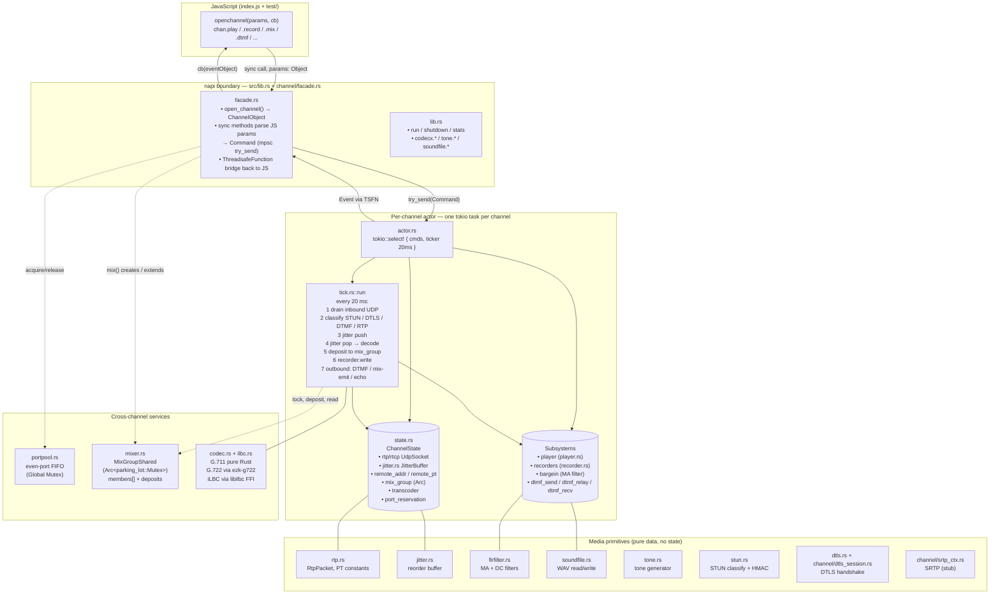

# projectrtp architecture

This is a map of the Rust code under `rust/src/`. Start with the diagram,
then the "how a packet flows" section, then the per-module index when you
need a specific file.

For the port-from-C++ history and status, see [MIGRATE.md](./MIGRATE.md).

## Layout at a glance

Two shapes in the diagram:
- **Rectangles** are code (modules, functions).
- **Cylinders** are owned state (lives on the actor side, one per channel).

## How a packet flows

**Inbound** (UDP arrives on the channel's RTP socket):

1. `tick.rs::drain_inbound` reads up to `MAX_INBOUND_PER_TICK` datagrams from `state.rtp_sock`.
2. `classify_and_route` peeks the first byte to route to one of:
   - **STUN** — if `stun::is_stun`, verify MESSAGE-INTEGRITY with the channel's `local_icepwd`, craft a Binding Response, send it back. Return.
   - **DTLS** — content type 20-23. Drop for now (DTLS wiring is stubbed).
   - **RFC 2833** — if PT matches `state.rfc2833_pt`, decode the digit; emit `TelephoneEvent`; if the channel is mixed, forward `MixRelayDtmf` to peer channels; interrupt any active `Player` with `interrupt=true`. Return.
   - **Otherwise** — RTP media. `state.in_count += 1`. Push into `state.jitter` (the reorder buffer).
3. One packet per tick pops out of `state.jitter` into `inbound_pkt`.
4. If a `mix_group` is set, the popped packet's payload is decoded (via `state.transcoder`) and **deposited** into the channel's slot in the shared `MixGroupShared`.
5. If any `recorder` is active, the decoded samples are interleaved 2-channel (in + in for echo, in + 0 otherwise) and written.
6. Barge-in: if a player is active and inbound RMS > threshold, drop the player and emit `Play{End, reason: "interrupted"}`.

**Outbound** (every 20 ms tick, in priority order):

1. **Mix group** active → if this channel's `mix_slot` is in a group:
   - 2 members alive → bounded catch-up (1:1 with peer deposits, capped at 2/tick).
   - 3+ members alive → tick-driven (one packet per tick, silence before any deposit).
   - In either case: read `summed_minus(own_idx)`, encode to `state.remote_pt`, send to `state.remote_addr`.
2. **DTMF** takes priority over mix audio when active: `dtmf_send` (JS-initiated) and `dtmf_relay` (regenerated from peer mix) both emit as RFC 2833 bursts.
3. **Echo** — if `state.echo == true` and there's an inbound packet, mirror it back to remote.
4. **Silence** — no fallback. The C++ default is "silent until someone asks for media"; earlier fallback-silence caused stray PCMA packets to bleed into tests.

## Control plane: JS → Rust → JS

**JS → Rust** goes through `Command`s on an mpsc channel:
- `channel.remote({...})` → `Command::Remote` (also pushes `SetPeerRemote` to a bound mix peer).
- `channel.mix(other)` / `channel.unmix()` → `BindMixGroup` / `UnbindMixGroup` on both sides.
- `channel.play(...)` / `.record(...)` / `.playrecord(...)` → `Play` / `Record` / `PlayRecord` (facade pre-parses JSON into typed configs).
- `channel.dtmf("123")` → `Command::Dtmf`.
- `channel.direction({send, recv})` → `Command::Direction`.
- `channel.close(reason)` → `Command::Close`.

Each `Command` is received in the actor's `tokio::select!` loop ahead of the next 20 ms tick (biased select). The actor is the **sole mutator of per-channel state**, so there's no locking on the hot path inside the channel.

**Rust → JS** goes through the `EventSink` trait — the production impl (`JsEventSink` in `facade.rs`) wraps a napi `ThreadsafeFunction` that marshals the event struct to a JS object and calls the user-supplied callback. Event types: `Close`, `Play{Start,End}`, `Record{Recording,Finished}`, `TelephoneEvent`, `Mix{state}`.

## Per-module index

| File | Role |
|---|---|
| `rust/src/lib.rs` | napi entry. Exports `run` / `shutdown` / `stats` and the `codecx`, `tone`, `soundfile`, `rtpbuffer`, `rtpfilter`, `dtls` namespaces. Initializes the port pool from `run({ports})`. |
| `rust/src/channel/facade.rs` | The `#[napi]` surface. `open_channel()` binds sockets (via portpool or ephemeral fallback), spawns the actor, and returns a `ChannelObject`. Sync methods (`play`, `record`, `playrecord`, `mix`, `unmix`, `remote`, `direction`, `echo`, `dtmf`) parse JS params and fire `Command`s. |
| `rust/src/channel/actor.rs` | The tokio task. Select loop over commands and a 20 ms ticker. Owns `ChannelState` + `Subsystems`. Handles command dispatch and fires final `Close` event. |
| `rust/src/channel/state.rs` | `ChannelState` struct. All per-channel data: sockets, jitter buffer, remote config, mix-group refs, transcoder, port reservation, stats counters. |
| `rust/src/channel/commands.rs` | `Command` enum (Remote, Play, Record, Dtmf, Mix group bind/unbind, etc) plus `Handle` (cheap-cloneable mpsc sender held by JS). |
| `rust/src/channel/tick.rs` | The 20 ms pipeline. Contains `run()`, `drain_inbound()`, `classify_and_route()`, plus inline DTMF / mix / echo outbound paths. |
| `rust/src/channel/rtp.rs` | `RtpPacket` plus free functions for header getters/setters. Payload type constants. |
| `rust/src/channel/jitter.rs` | `JitterBuffer` — sn-indexed reorder buffer, water-level prime, OOR drop. |
| `rust/src/channel/mixer.rs` | `MixGroupShared` + `MixMember`. Shared state for N-way mix, accessed under `parking_lot::Mutex` from multiple actors. `deposit`, `summed_minus`, `total_other_deposits`, `tombstone`. |
| `rust/src/channel/player.rs` | `Player` + `SoundSoupSpec`. Playlist driver; reads WAV frames via `soundfile::WavReader`. |
| `rust/src/channel/recorder.rs` | `Recorder` — WAV writer with pause, finish-on-request, power-gated start (RMS + MA + 100-packet warm-up), below-power finish, max-duration cap. |
| `rust/src/channel/dtmf.rs` | RFC 2833 send + receive. `DtmfSender` queues bursts (11 body + 3 end packets per digit); `DtmfReceiver` de-duplicates and reports digit-by-digit. |
| `rust/src/channel/dtls_session.rs`, `dtls.rs` | DTLS handshake (rustls-based). Currently stub — certificate fingerprint exposed but no handshake driving yet. |
| `rust/src/channel/srtp_ctx.rs` | SRTP context (libsrtp2 FFI). Stub; lands alongside DTLS-SRTP. |
| `rust/src/portpool.rs` | Global even-port FIFO. `run({ports:{start,end}})` fills it; `openchannel` acquires, `ChannelState::Drop` releases. `PortReservation` RAII guard. |
| `rust/src/codec.rs` | `Transcoder` struct + pure-Rust G.711 (ported from spandsp tables). Lazy-inits G.722 (`ezk-g722`) and iLBC on first use. Recognises up to two iLBC dynamic PTs (self + peer) for RFC dynamic-PT negotiation. |
| `rust/src/ilbc.rs` | Safe wrapper over the 6 libilbc functions we need (encode/decode 20 ms frames). Docker builds libilbc from `libilbc/` via CMake; Fedora / Debian expect the system `-devel`/`-dev` package. |
| `rust/src/firfilter.rs` | `DcFilter`, `MaFilter`, `Lowpass3_4k16k`. Reused by recorder power calc + barge-in detector + codec anti-alias. |
| `rust/src/rtpbuffer.rs` | Standalone ring container — used as a building block by sound/recorder subsystems. |
| `rust/src/soundfile.rs` | WAV read/write. `WavReader::read_samples`, `WavWriter::write_samples` (RAII header finalization on Drop). |
| `rust/src/stun.rs` | STUN classification, HMAC-SHA1 integrity, CRC-32 FINGERPRINT, XOR-MAPPED-ADDRESS. Pure functions; `tick.rs` calls `stun::handle` during `classify_and_route`. |
| `rust/src/tone.rs` | Tone generator (`tone.generate(descriptor, file)` in JS). Frequency-sum / sweep / cadence parser + WAV append. |

## Keeping this doc honest

Update this file when **shape** changes, not when behaviour inside a shape
is tuned. Specifically:

- **New module** under `rust/src/` — add a row to the per-module index.
- **New `Command` variant**, `Event` variant, or actor field that other
  subsystems can see — mention it in "Control plane" or the matching
  piece of the diagram.
- **Packet-flow change** (new codec fast path, DTLS handshake lands, new
  inbound classifier branch) — update "How a packet flows" and, if it's
  visible at the boundary, the mermaid diagram.
- **Concurrency change** (sharded runtimes, moving state between actors,
  dropping the shared mix-group lock) — rewrite the one-paragraph
  concurrency model.

What **doesn't** need an update: internal refactors that don't change a
module's role, bug fixes, test tuning, performance tweaks. MIGRATE.md
tracks *progress*; this file tracks *shape*.

## Concurrency model in one paragraph

Each channel is a tokio task with exclusive ownership of its `ChannelState`. JS-facing calls are synchronous — they parse params on the caller thread and fire a `Command` via `mpsc::try_send` (unbounded spillover → return false is treated as "channel busy, drop"). The actor loop is `tokio::select! { biased; cmds.recv(), ticker.tick() }` — one command or one tick per loop iteration, never both. Cross-channel interaction (mix group, DTMF relay) goes through the shared `Arc<parking_lot::Mutex<MixGroupShared>>` — locked for microseconds per tick, never across `await`. Outbound events to JS go through a napi `ThreadsafeFunction`, which trampolines onto the libuv thread. No locks on the inbound packet hot path; the jitter buffer and codec state are exclusive to the actor.
