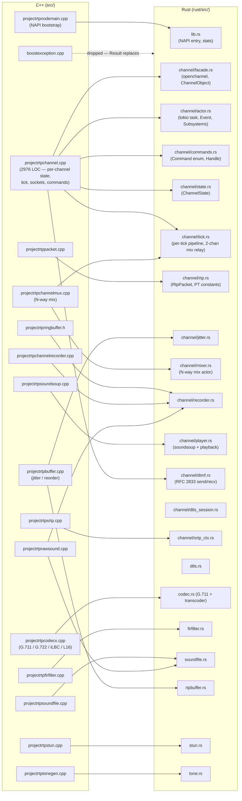

# C++ → Rust migration

This document tracks the in-flight port of the projectrtp C++ NAPI addon
(under `src/`) to a Rust napi-rs crate (under `rust/`). The old addon still
builds and is the canonical reference for behavior; the tests in `test/` are
the shared acceptance criteria.

## Whilst testing

Build the test image:
```bash
docker build -f Dockerfile.rust --target test -t projectrtp-test .
```

Build a production version
```bash
docker build -f Dockerfile.rust --target app -t projectrtp-app .
```

Run the full test suite:                                                                                                                                         

```bash
docker run --rm projectrtp-test

# or just a file
docker run --rm projectrtp-test \
  ./node_modules/mocha/bin/_mocha \
  test/interface/projectrtpserver.js \
  test/interface/projectrtpplayrecord.js \
  test/interface/projectrtprecord.js \
  --exit

```

## Migration strategy

- **Behavior-preserving, not line-by-line.** The tests in `test/interface/`
  and `test/unit/` are the contract. Rust modules are free to reshape the
  implementation as long as the JS surface and observable wire behavior
  match.
- **Module-at-a-time.** One C++ translation unit maps to one Rust module
  (sometimes split further — e.g. `projectrtpchannel.cpp` at ~3k LOC fans
  out across `channel/{actor,commands,state,tick,facade,rtp,jitter}.rs`).
- **Actor model replaces shared-mutex state.** The C++ code uses spinlocks
  and `shared_from_this`; the Rust port gives each channel a tokio task
  that owns its `ChannelState` exclusively. Outside callers (JS, other
  channels, the mix group) send `Command`s through an mpsc queue. See
  `rust/src/channel/actor.rs` header comment for the ownership rules.
- **Fast paths stay fast.** The 2-channel mix is implemented as a byte
  relay in `tick.rs` (no mix group actor, no decode/encode round-trip)
  because it covers the overwhelming majority of production traffic and
  every `test/interface/projectrtpmix.js` test. The full N-way mix lives
  in `channel/mixer.rs` and is only used when >2 channels or when a codec
  combination the relay can't handle shows up.
- **Safety by design.** Unsafe is confined to FFI shims only (SRTP, iLBC,
  G.722 bindings). Everything else is safe Rust — no raw pointers, no
  manually tracked lifetimes, no `shared_from_this`.

## File mapping



### Per-file notes

| C++ file | Rust module(s) | Status | Notes |
|---|---|---|---|
| `projectrtpnodemain.cpp/.h` | `lib.rs` | stub | `run()` / `shutdown()` are no-ops; `stats()` returns a placeholder. Real counters pending. |
| `projectrtpchannel.cpp/.h` | `channel/{facade,actor,commands,state,tick,rtp,jitter}.rs` + `channel/dtmf.rs` | in progress | Largest unit; split by concern. See `channel/mod.rs` header for port order. |
| `projectrtpchannelmux.cpp/.h` | `channel/mixer.rs` (+ 2-chan fast path in `channel/tick.rs`) | partial | 2-channel byte relay works. N-way sum/sub pipeline is shape-only; codec-level decode/encode for mix is TODO. |
| `projectrtpchannelrecorder.cpp/.h` | `channel/recorder.rs` | done | WAV writer, pause/resume, `finish` requests, power-gated start (`startabovepower`) and below-power finish (`finishbelowpower`) with RMS + MA. The 100-packet warm-up is counted *per recorder* (matches C++ `codecx::inpkcount`, which is incremented post-jitter — using the pre-jitter `state.in_count` shifted gate-open by one water-level's worth of packets). Multiple concurrent recorders via `Vec<Recorder>` in `Subsystems`. 7/7 `projectrtprecord.js` tests pass. **Reminder:** the cargo unit test `start_gate_holds_until_power_above_threshold` in `channel/recorder.rs` was written against the old no-warm-up behavior — with the 100-packet warm-up now in place it needs to be updated (feed ≥100 warm-up frames before the active frames) the next time we touch these unit tests. |
| `projectrtppacket.cpp/.h` | `channel/rtp.rs` | done (getters/setters) | Backing buffer is `BytesMut`; free-function parsers work on `&[u8]`. |
| `projectrtpbuffer.cpp/.h` | `channel/jitter.rs`, `rtpbuffer.rs` | done | `jitter.rs` owns the reorder logic; `rtpbuffer.rs` is the std-level ring container. |
| `projectrtpringbuffer.h` | folded into `channel/recorder.rs` / `soundfile.rs` | done | Tiny header — inlined where used. |
| `projectrtpcodecx.cpp/.h` | `codec.rs` | partial | G.711 transcode is pure Rust (port of spandsp tables). G.722 / iLBC / L16 still FFI. |
| `projectrtpfirfilter.cpp/.h` | `firfilter.rs` | done | |
| `projectrtpsoundfile.cpp/.h` | `soundfile.rs` | partial | Read/write WAV headers, raw PCM. SoundSoup playback overlap is in `channel/player.rs`. |
| `projectrtpsoundsoup.cpp/.h` | `channel/player.rs` | partial | JSON parsing in `channel/facade.rs::parse_soundsoup`. Player is created on `Command::Play` / `Command::PlayRecord`, advanced one frame per tick, and drops on DTMF interrupt, barge-in (RMS > `bargeinpower` via `Subsystems::bargein`), or natural end (emits `play/end reason=completed`). Outbound player audio over RTP is still TODO — needed to pass the full `projectrtpsound.js` suite but not the `playrecord` suite (which passes 5/5). |
| `projectrtprawsound.cpp/.h` | inlined in `soundfile.rs` / `channel/recorder.rs` | done | Standalone class wasn't needed once recorders had WAV writers. |
| `projectrtpsrtp.cpp/.h` | `channel/srtp_ctx.rs` | stub | libsrtp2 FFI placeholder. DTLS-SRTP wiring lands with the DTLS handshake. |
| `projectrtpstun.cpp/.h` | `stun.rs` | done (for the 2-party ICE use case) | Classification, HMAC-SHA1 integrity, CRC-32 fingerprint, XOR-MAPPED-ADDRESS. Local/remote ICE passwords threaded through `ChannelState` (`local_icepwd` / `remote_icepwd`); tick.rs intercepts inbound STUN and replies before the packet reaches the jitter buffer. |
| `projectrtptonegen.cpp/.h` | `tone.rs` | done | |
| `boostexception.cpp` | — | dropped | Boost exception shim not needed — Rust `Result` replaces it. |

### New modules (no direct C++ equivalent)

| Rust module | Purpose |
|---|---|
| `channel/actor.rs` | Per-channel tokio async task. Tasks (not OS threads) are multiplexed onto tokio's default multi-thread runtime, which runs one worker thread per core. This is close in spirit to the C++ IOCP model (N worker threads, 1 per core, work dispatched by event) but not identical: tokio work-steals tasks across workers, so a given channel can migrate between cores. The C++ build pins work more firmly. See the "Scheduler" section below. |
| `channel/commands.rs` | `Command` enum + `Handle` — replaces the C++ lock-guarded method calls. |
| `channel/dtmf.rs` | RFC 2833 send queue + receive FSM — was inline in `projectrtpchannel.cpp`. |
| `channel/dtls_session.rs`, `dtls.rs` | Rustls-based DTLS; C++ used gnutls inline in `projectrtpsrtp.cpp`. |
| `portpool.rs` | Even-port FIFO (RTP on P, RTCP on P+1). Port of the `availableports` queue in `projectrtpchannel.cpp`. Falls back to ephemeral bind-with-retry when the pool is uninitialized (test harnesses that skip `run({ports})`). |

## Ownership model at a glance

```mermaid
stateDiagram-v2
  [*] --> Local: openchannel()
  Local --> Mixed: channel.mix(other)
  Mixed --> Local: channel.unmix()
  Local --> Closing: channel.close()
  Mixed --> Closing: channel.close()
  Closing --> [*]: Event::Close

  note right of Local
    Actor owns ChannelState.
    tick.rs drives 20ms pipeline.
    Commands arrive via mpsc.
  end note

  note right of Mixed
    For 2 channels: both stay in Local
    mode with mix_peer_remote set.
    For N>2: ChannelState migrates into
    MixGroup actor; channel actor is a
    forwarder until Remove fires.
  end note
```

### 2-chan mix bind protocol

The 2-channel mix relay keeps both actors in the `Local` state and uses three
commands to track the peer relationship:

- `BindMixPeer { peer_handle, peer_remote, peer_pt, peer_rfc2833_pt }` —
  sent once per side from `facade::mix()`. Stores the peer's mpsc `Sender`
  on `state.mix_peer_handle` and records the peer's current outbound
  target. Emits `mix/start`. `peer_remote` may be `None` if the peer was
  opened without a `remote` block — the peer will push an update later.
- `SetPeerRemote { remote, pt, rfc2833_pt }` — sent from inside the
  `Remote` command handler whenever our own remote changes *while bound*.
  The receiver refreshes its outbound target only; no event.
- `UnbindMixPeer` — sent from `facade::unmix()` to one side; that side
  cascades the command to its peer via the stored handle and emits
  `mix/finished`. Keeps the two sides' bound state in sync without needing
  JS to call `unmix()` on both channels.

This shape lets `channel.mix(other)` succeed regardless of whether each
channel already has a `remote` configured — the test suite relies on this
("basic mix 2 channels with start 2 packets wrong payload type").

## Scheduler (C++ IOCP vs tokio)

The C++ build runs **N worker threads (1 per core)** with IOCP / io_uring,
each thread dispatching work directly from kernel completions with no
task-migration across cores. This keeps per-channel state hot in L1/L2
cache and avoids kernel thread context-switches on the hot path.

The Rust build currently runs each channel as an **async task** on
tokio's default multi-thread runtime (also 1 worker thread per core by
default). Per-channel OS-thread cost is *not* an issue — tokio tasks are
stackless futures multiplexed onto the worker pool — but:

- **Work-stealing** can migrate a task between workers. Good for load
  imbalance; bad for cache locality on a steady-state channel.
- **Task state-machine + waker overhead** per `select!` wakeup is small
  but non-zero vs a plain "loop { poll() }" per-core reactor.

Open question: whether this matters at production channel counts. Being
addressed in two steps:

1. `stress/perfbench.js` — a harness that opens N echoing channels and
   measures throughput, drop rate, and per-packet latency against both
   builds (see the file for how to run).
2. If the bench shows material overhead, evaluate: (a) sharded
   `current_thread` runtimes with CPU affinity — channels never migrate,
   but probabilistic load imbalance when correlated-lifetime channels
   close together; (b) a per-core epoll/io_uring reactor that drops
   tokio entirely — matches the C++ model but a much larger rewrite.

## Keeping this doc honest

Update this file whenever:

- A Rust module gains or loses a C++ source it ports.
- Status in the table above changes (stub → partial → done).
- A new Rust-only module is introduced (add to the "New modules" table).
- The ownership model shifts (mix group handoff, DTLS state migration, etc).

A helpful shape for commit messages touching `rust/src/` is to note the
section of this doc that should change. That keeps drift from creeping in.
